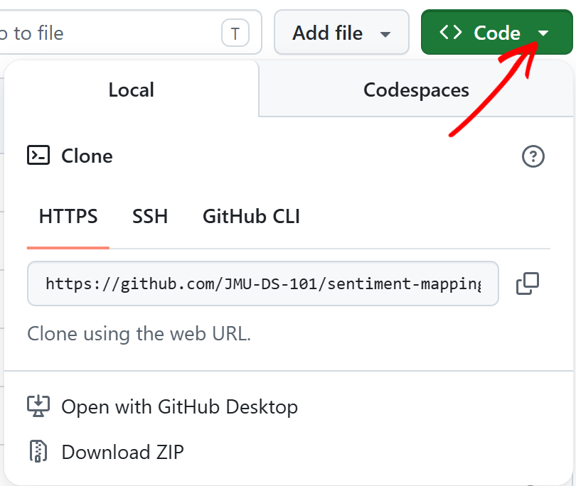
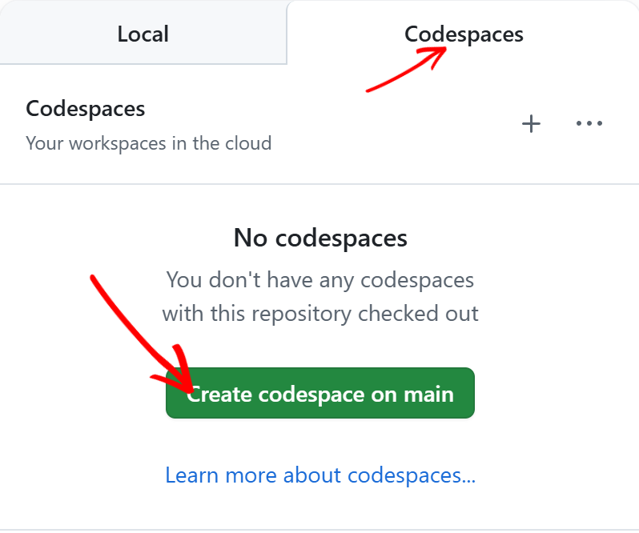

# DS 101 — Mapping Emotions: Reddit Sentiment Analysis

---

## Getting Started

Your instructor has added you to your team's repository. Follow these two steps to open your workspace.

### Step 1 — Open a Codespace

On this repository's page on GitHub.com, click the green **Code** button, then select the **Codespaces** tab:



Then click **Create codespace on main**:



The first build takes **10–15 minutes** — packages, models, and tools are all being installed. After that, reopening takes only a few seconds.

> **Each team member opens their own Codespace** from the shared team repo. Your work is separate until you commit and push.

### Step 2 — Start working

Once your Codespace is open, everything is already installed. Open the first lesson to begin:

**Explorer** (left sidebar) → `lesson_1_the_team/` → `lesson_1_1_git_and_pull_requests.ipynb`

---

## How to Read the Lessons

Each notebook uses a consistent set of callout icons. Knowing what they mean will help you move through the material more efficiently.

| Icon | Label | What it means |
|------|-------|---------------|
| 📖 | **Follow Along** | Run each cell in order. You do not need to write or modify any code — just observe what the code does and why. |
| 👉 | **Note** | A tip, clarification, or convention worth knowing. Not directly tied to the code output. |
| 📊 | **Output** | An observation about what the code just produced. Read it after running the cell above. |
| 💡 | **Reflection** | A discussion or critical thinking prompt. There is no single right answer — think it through and be ready to discuss. |
| ✍️ | **Activity** | You must write or modify code yourself. Read the instructions carefully before running anything. |

Sections that start with **📖 N Follow Along** are passive — run the cells and focus on understanding. Numbered sections without the 📖 icon are where you do the active work.

---

## Lesson Plan

### Lessons

| # | Notebook | Title | What you will do |
|---|----------|-------|-----------------|
| 1.1 | `lesson_1_1_git_and_pull_requests.ipynb` | Git and Pull Requests | Set up your team repo, make your first commit, and open a pull request. |
| 1.2 | `lesson_1_2_merge_conflicts.ipynb` | Merge Conflicts | Simulate and resolve a merge conflict with a teammate. |
| 1.3 | `lesson_1_3_dynamic_input.ipynb` | Dynamic Input | Generate your team page automatically from a data file using Python. |
| 2.1 | `lesson_2_1_overview_variables.ipynb` | Variables & Data Types | Learn how Python stores and labels information. |
| 2.2 | `lesson_2_2_functions_methods.ipynb` | Functions & Methods | Understand how to call functions, pass arguments, and chain methods. |
| 2.3 | `lesson_2_3_packages.ipynb` | Packages | Import and use third-party libraries. |
| 2.4 | `lesson_2_4_reading_code.ipynb` | Reading Code | Practice reading unfamiliar code and tracing what it does. |
| 3.1 | `lesson_3_1_loading_and_cleaning.ipynb` | Loading and Cleaning Data | Load a real Reddit dataset with pandas and inspect its structure. |
| 3.2 | `lesson_3_2_plotly_visualization.ipynb` | Visualizing Data with Plotly | Create bar charts and histograms from tabular data. |
| 3.3 | `lesson_3_3_plotly_practice.ipynb` | Plotly Practice | Apply visualization techniques to new questions. |
| 4.1 | `lesson_4_1_extracting_locations.ipynb` | Extracting Toponyms | Find place names in text using pattern matching and rules. |
| 4.2 | `lesson_4_2_using_ner.ipynb` | Named Entity Recognition | Use a machine learning model to extract location names automatically. |
| 4.3 | `lesson_4_3_geoparsing_mapping.ipynb` | Geoparsing in Python | Convert place names to coordinates and plot them on a map. |
| 4.4 | `lesson_4_4_preparing_review_sheet.ipynb` | Collaborative Location Review | Clean and validate the geoparsed data as a team. |
| 5.1 | `lesson_5_sentiment_analysis.ipynb` | Sentiment Analysis | Measure emotional tone in sentences using a lexicon-based approach. |
| 5.2 | `lesson_5_2_roberta_sentiment.ipynb` | Sentiment Analysis with RoBERTa | Run a transformer model to score sentiment more accurately. |
| 6 | `lesson_6_mapping_fundamentals.ipynb` | Mapping Fundamentals | Build interactive maps with Plotly, apply color scales, and classify data. |

### Project

Work through these notebooks in order after completing the lessons. Each part builds directly on the previous one.

| Part | Notebook | Title | What you will do |
|------|----------|-------|-----------------|
| 1 | `project_part_1_data_pipeline.ipynb` | Data Pipeline | Clean your school's Reddit dataset and run RoBERTa sentiment analysis on it. |
| 2 | `project_part_2_whitepaper.ipynb` | Analysis & Whitepaper | Analyze and compare sentiment patterns across schools; write up your findings. |
| 3 | `project_part_3_interactive_tour.ipynb` | Interactive Tour | Build an interactive map combining your school's data with the JMU baseline. |
| 4 | `project_part_4_global_variables.ipynb` | Global Variables & Submission | Configure global variables, finalize your site, and publish to GitHub Pages. |

---

## Initial Setup — Enable GitHub Pages

Do this **once** when your team first opens the repo. It takes about one minute and makes your site live for the whole team.

### Step 1 — Enable Pages in the repo settings

1. Go to your team's repository on **GitHub.com**.
2. Click the **Settings** tab (top of the repo, not the account settings).
3. In the left sidebar, click **Pages**.
4. Under **Branch**, select **main** and set the folder to **/docs**.
5. Click **Save**.

Your site URL will appear at the top of the Pages settings page:
```
https://<your-github-org>.github.io/<repo-name>/
```
Bookmark it — this link stays the same for the rest of the project.

### Step 2 — Run the publish script for the first time

In the terminal, run:

```bash
bash publish.sh
```

This creates the `docs/` folder GitHub Pages needs and pushes a first version of the site. The site will be live within about a minute.

From this point on, any team member can run `bash publish.sh` after merging work to `main` and the shared site will update automatically.

---

## Start Here — Lesson 1

Open the first lesson notebook to begin:

**Explorer** (left sidebar) → `lesson_1_the_team/` → `lesson_1_1_git_and_pull_requests.ipynb`

Work through the lessons in order. Each lesson builds on the previous one.

---

## Publishing Your Project

When you are ready to publish your team's website to GitHub Pages, run this from the terminal:

```bash
bash publish.sh
```

This will:
1. Rebuild the team page from your `team.csv`
2. Export the whitepaper notebook to HTML
3. Copy all pages (`index.html`, `team.html`, `interactive_tour.html`, `whitepaper.html`) into `docs/`
4. Commit and push to GitHub

Your site will be live at:
```
https://<your-github-org>.github.io/<repo-name>/
```

---

## Repository Layout

```
lesson_1_the_team/          ← Start here
lesson_2_very_basic_python/
lesson_3_introduction_pandas/
lesson_4_finding_locations/
lesson_5_sentiment_analysis/
lesson_6_mapping_fundamentals/
project_mapping_emotions/   ← Final project notebooks and website templates
publish.sh                  ← Run this to publish your site
docs/                       ← Auto-generated by publish.sh (GitHub Pages source)
```

